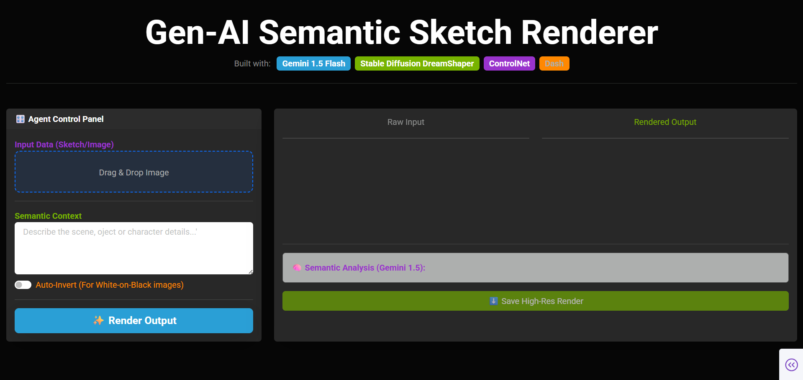

# 🎨 Gen-AI Semantic Sketch Renderer

A Generative AI application that transforms black-and-white sketches or line art into high-quality, colored images using semantic understanding and controlled diffusion.

---

## 🚀 Features
- Sketch-to-image generation using Stable Diffusion + ControlNet
- Semantic prompt generation with Gemini 1.5 Flash
- Edge-aware rendering using Canny detection
- GPU (CUDA) acceleration support
- Real-time progress tracking
- High-resolution image export
- Modern interactive UI built with Dash & Bootstrap

---

## 🖥️ Application UI Preview



---

## 🧠 How It Works
1. User uploads a sketch or line-art image
2. Image is preprocessed and edge-detected (Canny)
3. Gemini AI analyzes the sketch + user hints to generate a detailed prompt
4. Stable Diffusion DreamShaper renders the final image using ControlNet guidance
5. Output is displayed and can be downloaded in high resolution

---

## 🛠️ Tech Stack
- **Frontend**: Dash, Dash Bootstrap Components
- **AI Models**: Gemini 1.5 Flash, Stable Diffusion DreamShaper
- **Control**: ControlNet (Canny)
- **Backend**: Python, PyTorch
- **Image Processing**: OpenCV, PIL
- **Deployment Ready**: GPU / CPU support

---

## Project Structure
```text
AI-Semantic-Sketch-Renderer/
├── assets/
│   └── (Screenshots(.png)
├── .env (Gemini API Key)
├── app.py
├── requirements.txt
```
## ⚙️ Installation
```bash
git clone https://github.com/yourusername/ai-semantic-sketch-renderer
cd ai-semantic-sketch-renderer
pip install -r requirements.txt
```

---

## 👤 Author
### Abhinav Verma
<br>
Focused on building production-ready AI systems and mastering Deep Learning through projects.

---

## 📜 License
This project is for educational and research purposes.
Please comply with the licenses of Stable Diffusion and Gemini models.
